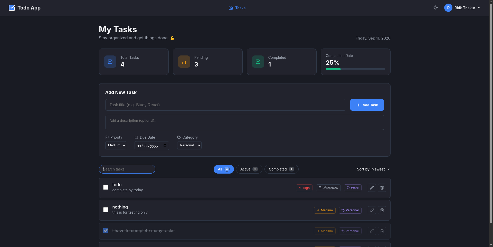

# Todo App - Full Stack Project



🚀 **Live Demo:** [https://todocrdy.vercel.app/](https://todocrdy.vercel.app/)


## 🚀 Version 2.0 Mega Update Features
- **Real-Time Collaboration**: Instant sync across all connected clients via `socket.io` WebSockets.
- **Optimistic UI**: Instant perceived performance (zero-latency UI updates) powered by `@tanstack/react-query`.
- **Drag & Drop Reordering**: Fluid sorting with `@dnd-kit/sortable`.
- **Advanced Task Management**: Subtasks, Priority badges, Categories, Assignments, and Due Dates.
- **Image Attachments**: Securely upload and host images using `Cloudinary` + `Multer`.
- **Infinite Scrolling**: Auto-loads more tasks using the `IntersectionObserver` API as you scroll.
- **Global Dashboard Statistics**: Live analytical breakdown (Total, Completed, Pending).
- **Advanced Keyboard Navigation**: `Ctrl+Enter` shortcut, `Escape` to close, and an accessible Focus Trap inside modals.
- **Nepali Date System**: Integrated `nepali-date-converter` for dual date display (BS).

## 🛠 What is Used
- **Frontend**: React.js, Vite
- **Backend**: Node.js, Express.js
- **Database**: MongoDB (Atlas) & Mongoose
- **Other Tools**: Postman, MongoDB Compass, Cloudinary, Socket.io, React Query, Dnd-Kit

## 🤔 Why Used
- **React.js**: For building a fast, interactive user interface using a component-based architecture.
- **Node.js & Express**: To create a robust and scalable backend API quickly using JavaScript.
- **MongoDB**: A NoSQL database that perfectly pairs with JavaScript applications since it uses JSON-like documents.
- **Vite**: A modern frontend build tool that provides a much faster development server than Create React App.

## 🎯 Objectives
- Understand the complete request-response cycle between a client and a server.
- Learn how to structure a full-stack application (MVC pattern).
- Practice CRUD operations with a real database.
- Learn to manage environment variables and CORS.

## ✨ Pros
- **Separation of Concerns**: The frontend and backend are completely decoupled.
- **Scalability**: Can easily swap the frontend or backend without affecting the other.
- **Modern Workflow**: Uses modern tools like Vite and ES Modules.
- **Trash feature**: instead of deleting the todos permanently, it moves them to the trash and can be restored. Trash ui is hidden and can be opened with `alt + r + t` shortcut.

## 🚀 Guide for Demo Running (Commands to Start)

### 1. Database Setup
Create a free MongoDB cluster on Atlas and get your connection string. 
In the `server` directory, create a `.env` file based on `.env.example`:
```env
PORT=5000
MONGODB_URI=your_mongodb_connection_string_here
```

### 2. Start the Backend
Open a terminal and run:
```bash
cd server
npm install
npm run dev

cd ~/extra/intern/task1/todo-app/server
 npm run dev
```
The server will run on http://localhost:5000.

### 3. Start the Frontend
Open a second terminal and run:
```bash
cd client
npm install
npm run dev

cd ~/extra/intern/task1/todo-app/client
 npm run dev
```
The frontend will run on http://localhost:5173.


## 🌍 Production Deployment

This project uses a decoupled deployment strategy for maximum performance and stability:

### 1. Backend (Render)
The Node.js/Express server is hosted on [Render](https://render.com).
- **Root Directory**: `server`
- **Build Command**: `npm install`
- **Start Command**: `npm start`
- **Environment Variables**:
  - `PORT`: `5000`
  - `MONGODB_URI`: Your MongoDB Atlas connection string.

### 2. Frontend (Vercel)
The React/Vite client is hosted on [Vercel](https://vercel.com) for global CDN edge delivery.
- **Root Directory**: `client`
- **Environment Variables**:
  - `VITE_API_URL`: The live URL provided by Render (e.g., `https://todo-crdy.onrender.com/api/todos`)

---

## 📚 Additional Guides
For more detailed information, please check out:
- [Frontend Guide](./client/README.md)
- [Backend Guide](./server/README.md)
